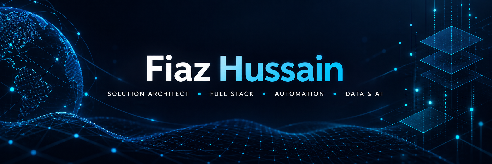
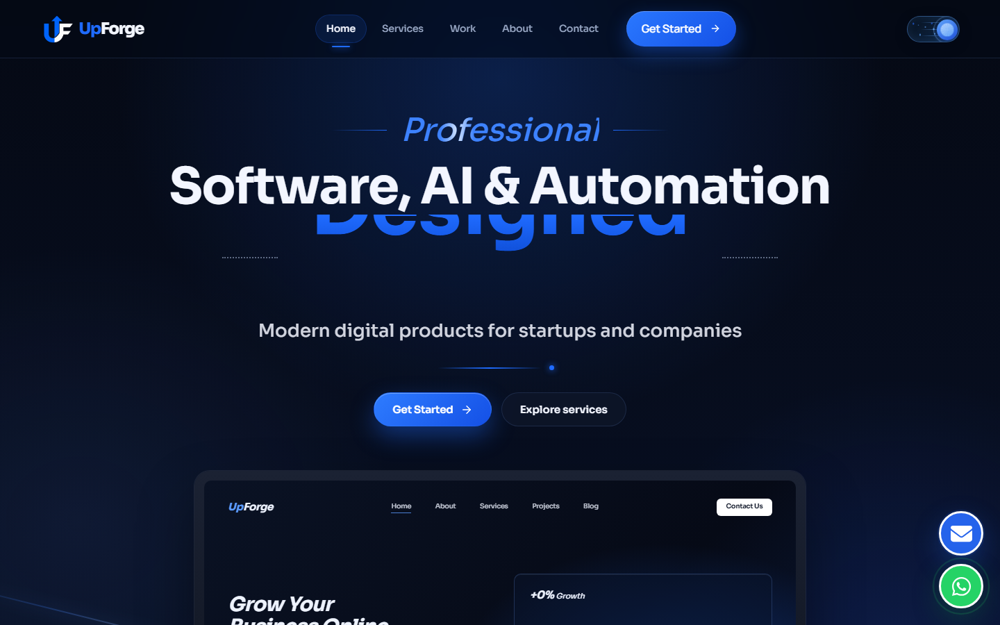
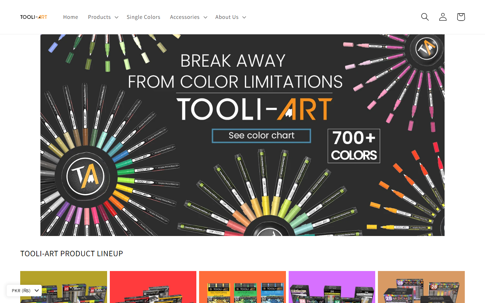

## 👨‍💻 About Me

I'm **Fiaz Hussain**, a Senior Solution Architect, Full-Stack Developer, and Automation Engineer with **6+ years of experience** across software engineering, integrations, data, cloud, and AI-enabled applications. I design secure, production-ready architectures and build responsive web/mobile products, scalable APIs, CRM systems, analytics workflows, and business automations—from requirements and system design through deployment, optimization, and ongoing maintenance.

My work spans **frontend and backend development, APIs, third-party integrations, databases, bug fixing, UI improvements, performance optimization, no-code automation, data engineering, analytics, and AI-powered workflows**.

- 🔭 Building full-stack products, multi-tenant platforms, CRM integrations, and AI-enabled workflows
- ⚙️ Automating lead capture, pipelines, notifications, follow-ups, and cross-system synchronization
- 📊 Turning operational, marketing, search, and user-activity data into useful datasets and dashboards
- 🤖 Integrating AI chatbots, recommendations, intelligent search, and automated lead qualification
- 🌍 Available for remote collaboration, custom applications, integrations, and long-term maintenance

## 🧭 What I Do

| Full-Stack Development | Automation & Integrations | Data & AI | Mobile & CMS |
|---|---|---|---|
| React, TypeScript, Python, Django, DRF, FastAPI, Flask, Node.js | GHL, HubSpot, n8n, Zapier, Make.com, webhooks | SQL, BigQuery, Elasticsearch, ETL/ELT, BI, AI APIs | Flutter, React Native, Kotlin, Firebase, WordPress, Shopify |
| SaaS, REST APIs, microservices, multi-tenant systems | CRM, Google APIs, Calendar, SMS/Viber, lead routing | Data analysis, engineering, science, RAG, AI agents | Android/iOS, WooCommerce, ecommerce, custom websites |

## 🛠️ Technical Toolbox

### Languages & Frontend

### Backend, Mobile & Databases

### Cloud, DevOps & Tools

**Automation:** GoHighLevel (GHL) · HubSpot CRM · n8n · Zapier · Make.com · Webhooks · Python Automation · Web Automation · SMS/Viber Automation · Lead Routing

**Data & Analytics:** BigQuery · Elasticsearch · Kibana · Looker Studio · Power BI · Grafana · ETL/ELT · Data Warehousing · KPI & Conversion Analysis

**AI & Tracking:** LLMs · RAG · AI Agents · OpenAI API · Claude API · AI Chatbots · Recommendation Workflows · Intelligent Search · Google Tag Manager · LinkedIn Insight Tag · Meta Pixel

**Engineering:** Solution Architecture · REST APIs · Microservices · Multi-Tenant SaaS · PostgreSQL · MySQL · MongoDB · Supabase · AWS · GCP · DigitalOcean VPS · Cloud Run · DataProc · CI/CD

## 🚀 Selected Professional Work

> Selected client and professional projects. Contributions include frontend, backend, APIs, integrations, databases, UI updates, debugging, analytics, automation, and ongoing maintenance. Some source repositories are private due to client confidentiality.

### [UpForge — Software, AI & Automation Engineering](https://upforge.us/)

Professional software-engineering platform delivering modern digital products for startups and companies. Work covers solution architecture, full-stack systems, backend APIs, AI/LLM integrations, automation, cloud deployment, and production optimization.

`Solution Architecture` `SaaS` `Python` `FastAPI` `Django` `Node.js` `AI Agents` `AWS` `Docker`

---

### [PromptForge — Enterprise AI Governance Platform](https://www.mypromptforge.com/)

Enterprise AI governance experience focused on controlled AI usage, multi-tenant isolation, governed knowledge, access control, and auditability.

`Full-Stack Development` `AI Integrations` `Multi-Tenant Architecture` `APIs` `Frontend` `Backend`

---

### [Big Easy Data — Visitor Intelligence & Analytics](https://bigeasydata.ai/)

Data tracking and visitor-intelligence platform with lead identification, behavioral signals, real-time analytics, audience segmentation, and marketing activation workflows.

`Data Engineering` `Analytics` `Tracking` `Automation` `Dashboards` `API Integrations`

---

### [Tooli UK — Tool & Plant Hire Marketplace](https://www.tooli.uk/)

A UK-focused marketplace for comparing tool and plant hire options. Work spans a TypeScript frontend, Python backend, APIs, data workflows, and containerized services.

`TypeScript` `Python` `Full-Stack` `Marketplace` `APIs` `Docker`

---

### [Tooli-Art — Art Supplies E-Commerce](https://tooli-art.com/)

E-commerce experience for professional paint pens, color collections, acrylic brushes, accessories, product discovery, cart, and checkout workflows.

`Shopify` `E-Commerce` `Product Catalogue` `Frontend` `Integrations` `Optimization`

---

### [Wavehire.tv — Professional Broadcast Equipment Hire](https://wavehire.tv/)

Responsive equipment-hire experience for professional wireless video, camera-control, and IP-data systems, including product discovery and enquiry workflows.

`Frontend Development` `Responsive UI` `Product Catalogue` `E-Commerce UX` `Maintenance`

---

### [Wavetek TV — Live Production Technology](https://wavetek-frontend-7homzqrazq-ew.a.run.app/)

An in-progress product and commerce experience for live-production video, control, and connectivity technology, deployed on Google Cloud Run.

`In Progress` `Frontend` `Product Experience` `Cloud Run` `Responsive Design`

---

### [BisViews — Business Reviews & Search Platform](https://bisviews.com/)

Business discovery and reviews platform supported by search, ranking, analytics, and data workflows. Professional work included intelligent search, Elasticsearch/BigQuery synchronization, and performance monitoring.

`Python` `Elasticsearch` `BigQuery` `Search Ranking` `Kibana` `Analytics`

## 🔒 Selected Private / Client Engineering

These projects are represented by capability and outcome because their source code is private:

- **CRM & Multi-Tenant Platforms** — React and Python applications integrating Freshdesk, Pipedrive, email, calendars, lifecycle management, and secure REST APIs.
- **AI & E-Commerce Automation** — AI-enabled customer journeys, recommendations, lead workflows, chatbots, campaign operations, and product-performance reporting.
- **No-Code Business Automation** — GHL, n8n, Zapier, and Make.com workflows for lead capture, contact creation, pipeline updates, notifications, follow-ups, and synchronization.
- **Search & Recommendation Systems** — Python-powered ranking, Elasticsearch search services, BigQuery warehousing, recommendation tuning, and Kibana monitoring.
- **Marketing Data & Tracking** — Website/pixel tracking, LinkedIn Ads workflows, Meta Pixel, Google Tag Manager, conversion events, audience data, and reporting dashboards.
- **Mobile Applications** — Flutter and React Native apps with Firebase, authentication, REST APIs, push notifications, payments, Google Maps, and release support.
- **WordPress & WooCommerce** — Elementor/Gutenberg builds, theme and plugin customization, ecommerce flows, SEO readiness, performance, migrations, backups, and maintenance.

## 📦 Open-Source & Public Repositories

| Project | Description | Stack |
|---|---|---|
| [QuizOnline](https://github.com/prodeveloperpy-hash/quizonline) | Student, teacher, and admin quiz platform with academic and AI-assisted workflows | PHP, MySQL, JavaScript |
| [Quiz Online](https://github.com/prodeveloperpy-hash/quiz-online) | Multi-stack quiz system with modern and beginner-friendly implementations | React, TypeScript, FastAPI, Python, PHP |
| [Agency](https://github.com/prodeveloperpy-hash/agancey) | Responsive agency frontend prepared for web deployment | TypeScript, CSS, HTML |
| [Tooli UK](https://github.com/prodeveloperpy-hash/Tooli_UK) | Full-stack service marketplace application | TypeScript, Python, Docker |
| [CardWise](https://github.com/prodeveloperpy-hash/Altiora-Digital-Labs) | Credit-card discovery and recommendation platform | React, FastAPI, SQLAlchemy |
| [Shahzad Khan](https://github.com/prodeveloperpy-hash/shahzadkhan) | Responsive personal portfolio | HTML, CSS, JavaScript |
| [Portfolio](https://github.com/prodeveloperpy-hash/Portfolio) | Digital portfolio for projects and technical work | HTML, CSS, JavaScript |
| [Shahzad](https://github.com/prodeveloperpy-hash/shahzad) | Interactive portfolio with responsive design and contact flow | HTML, CSS, JavaScript |
| [Testing](https://github.com/prodeveloperpy-hash/testing) | Experimental sandbox for testing ideas and learning workflows | Sandbox |

## 💼 Professional Experience

### Senior Solution Architect — UpForge

**Full-time · July 2026 – Present**

- Design scalable and secure architectures for SaaS, AI, automation, and enterprise applications.
- Architect backend systems using Python, FastAPI, Django, Node.js, PostgreSQL, and Supabase.
- Design REST APIs, microservices, database architecture, authentication, and third-party integrations.
- Build cloud solutions using AWS, Docker, and CI/CD with a focus on security, reliability, and scale.
- Design AI-powered systems using LLMs, RAG, AI agents, OpenAI, and Claude APIs.
- Integrate CRMs, payment systems, communication APIs, business platforms, and automation tools.
- Lead technical decisions from requirements analysis and system design through delivery and optimization.

**Key achievement:** Designed and delivered end-to-end architectures for complex AI, SaaS, automation, and API-integrated platforms, transforming business requirements into scalable production systems.

### Backend Engineer — UpSurge

**Full-time · June 2024 – July 2026**

- Developed scalable backend systems using Python, Django, FastAPI, Node.js, and REST APIs.
- Designed and optimized PostgreSQL, MySQL, MongoDB, and Supabase databases.
- Built secure APIs, authentication, third-party integrations, and automation workflows.
- Worked with AWS, Docker, CI/CD, and cloud deployments.
- Integrated OpenAI, Claude, RAG, and AI agents into backend applications.
- Developed SaaS platforms, data-processing systems, web-scraping solutions, and business automation tools.

**Key achievement:** Delivered production-ready backend and AI automation solutions combining APIs, databases, cloud infrastructure, and AI services for scalable business applications.

### Additional Selected Experience

- **ISHO Tech** — CRM and multi-tenant applications, Python APIs, React interfaces, automation, integrations, chatbots, and conversion tracking.
- **Fashion Commerce** — AI-enabled ecommerce, customer journeys, B2B marketing workflows, dashboards, and campaign automation.
- **BisViews** — Intelligent search, Elasticsearch/BigQuery synchronization, analytics, warehousing, ranking, and Kibana monitoring.

## 🎓 Education & Certification

- **M.Sc. Computer Science** — Government College University Lahore (GCUL), Pakistan · Graduated 2021
- **Microsoft Data Scientist Certification** · 2022

## ☁️ Cloud & Deployment Capability

Production deployment experience across **AWS, Google Cloud Platform, Cloud Run, DigitalOcean VPS, Docker, Linux, managed databases, CI/CD, monitoring, and scalable application hosting**. DigitalOcean VPS supports common production workloads such as websites, ecommerce, SaaS, databases, microservices, and AI/ML applications. [Explore DigitalOcean VPS](https://www.digitalocean.com/solutions/vps-hosting).

## 📈 GitHub Activity

## 🤝 Let's Build Something Useful

Need a custom web or mobile application, backend API, CRM integration, workflow automation, analytics pipeline, AI feature, or long-term maintenance support?

### Open to freelance work, product collaboration, integrations, and long-term engineering support.

---

**Architecture • Engineering • Automation • Data • AI**

