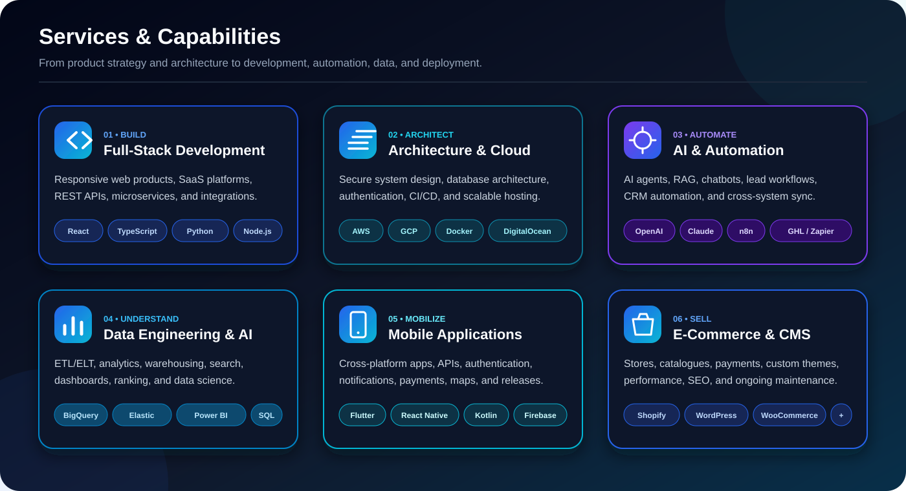
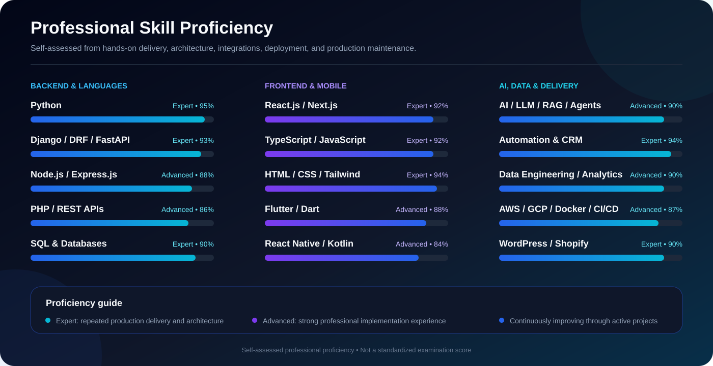
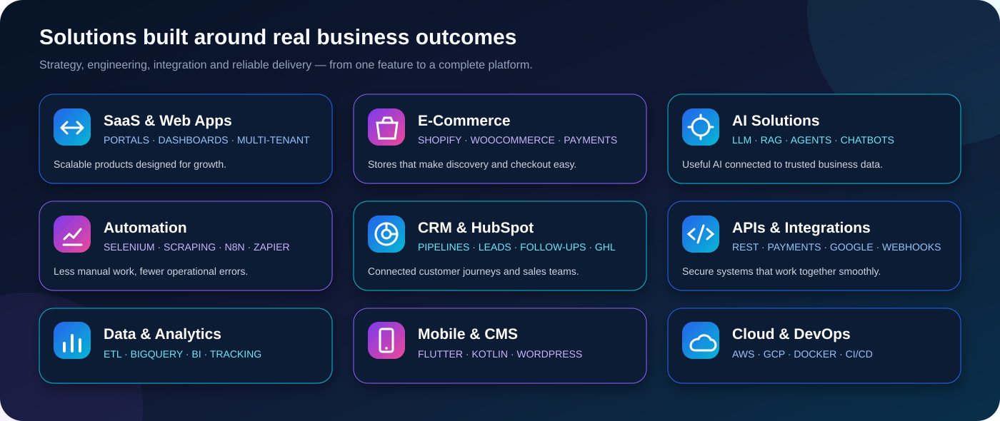
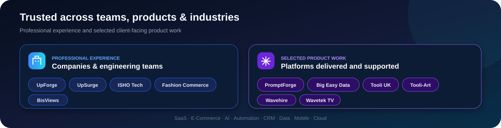
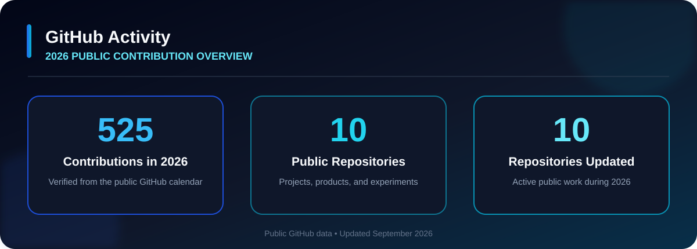

## 👨‍💻 About Me

I'm **Fiaz Hussain**, a Senior Solution Architect, Full-Stack Developer, and Automation Engineer with **6+ years of experience** across software engineering, integrations, data, cloud, and AI-enabled applications. I design secure, production-ready architectures and build responsive web/mobile products, scalable APIs, CRM systems, analytics workflows, and business automations—from requirements and system design through deployment, optimization, and ongoing maintenance.

My work spans **frontend and backend development, APIs, third-party integrations, databases, bug fixing, UI improvements, performance optimization, no-code automation, data engineering, analytics, and AI-powered workflows**.

- 🔭 Building full-stack products, multi-tenant platforms, CRM integrations, and AI-enabled workflows
- ⚙️ Automating lead capture, pipelines, notifications, follow-ups, and cross-system synchronization
- 📊 Turning operational, marketing, search, and user-activity data into useful datasets and dashboards
- 🤖 Integrating AI chatbots, recommendations, intelligent search, and automated lead qualification
- 🌍 Available for remote collaboration, custom applications, integrations, and long-term maintenance

## 🧭 What I Do

**Product strategy → Architecture → Development → Integration → Deployment → Optimization**

## 🛠️ Technical Toolbox

### Languages & Frontend

### Backend, Mobile & Databases

### Cloud, DevOps & Tools

**Automation:** Selenium · Playwright · Web Scraping · GoHighLevel (GHL) · HubSpot CRM · n8n · Zapier · Make.com · Webhooks · Python Automation · SMS/Viber Automation · Lead Routing

**Data & Analytics:** BigQuery · Elasticsearch · Kibana · Looker Studio · Power BI · Grafana · ETL/ELT · Data Warehousing · KPI & Conversion Analysis

**AI & Tracking:** LLMs · RAG · AI Agents · OpenAI API · Claude API · AI Chatbots · Recommendation Workflows · Intelligent Search · Google Tag Manager · LinkedIn Insight Tag · Meta Pixel

**Engineering:** Solution Architecture · REST APIs · Microservices · Multi-Tenant SaaS · PostgreSQL · MySQL · MongoDB · Supabase · AWS · GCP · DigitalOcean VPS · Cloud Run · DataProc · CI/CD

## 🧩 Complete Technology Stack

| Area | Technologies & Capabilities |
|---|---|
| **Languages** | `Python` `JavaScript` `TypeScript` `PHP` `SQL` `Dart` `Kotlin` `HTML5` `CSS3` |
| **Frontend** | `React.js` `Next.js` `AngularJS` `Vite` `Tailwind CSS` `Responsive UI` `Accessibility` `Dashboards` |
| **Backend** | `Django` `Django REST Framework` `FastAPI` `Flask` `Node.js` `Express.js` `REST APIs` `Microservices` |
| **Databases** | `PostgreSQL` `MySQL` `MongoDB` `Supabase` `Firebase` `BigQuery` `Database Design` `Optimization` |
| **AI Engineering** | `LLMs` `RAG` `AI Agents` `OpenAI API` `Claude API` `Chatbots` `Recommendations` `Intelligent Search` |
| **Data** | `Data Engineering` `Data Analysis` `Data Science` `ETL/ELT` `Warehousing` `Elasticsearch` `Kibana` `Power BI` `Looker Studio` `Grafana` |
| **Automation** | `Python Automation` `Selenium` `Playwright` `Web Scraping` `n8n` `Zapier` `Make.com` `GHL` `HubSpot` `Webhooks` `Google APIs` `Calendar` `SMS/Viber` |
| **Mobile** | `Flutter` `React Native` `Android` `iOS` `Kotlin` `Firebase` `Push Notifications` `Payments` `Google Maps` |
| **Cloud & DevOps** | `AWS` `GCP` `DigitalOcean` `Cloud Run` `Docker` `Linux` `CI/CD` `Monitoring` `Performance` `Security` |
| **CMS & Commerce** | `WordPress` `WooCommerce` `Shopify` `Elementor` `Gutenberg` `E-Commerce` `Payments` `SEO` |
| **Architecture** | `Solution Architecture` `SaaS` `Multi-Tenant Systems` `Authentication` `Third-Party Integrations` `Scalability` |

## 📊 Skill Proficiency

## 💼 Services I Deliver

## 🤝 Companies & Products I Have Worked With

[**PromptForge**](https://www.mypromptforge.com/) · [**Big Easy Data**](https://bigeasydata.ai/) · [**Tooli UK**](https://www.tooli.uk/) · [**Tooli-Art**](https://tooli-art.com/) · [**Wavehire**](https://wavehire.tv/) · [**Wavetek TV**](https://wavetek-frontend-7homzqrazq-ew.a.run.app/)

## 🚀 Selected Work — Compact Gallery

> GitHub READMEs do not run JavaScript sliders, so this compact clickable gallery keeps the profile fast, reliable, and easy to scan.

<table>
  <tr>
    <td width="50%" align="center"> <b>UpForge</b> Software, AI & automation engineering</td>
    <td width="50%" align="center"> <b>PromptForge</b> Enterprise AI governance platform</td>
  </tr>
  <tr>
    <td align="center"> <b>Big Easy Data</b> Visitor intelligence & analytics</td>
    <td align="center"> <b>Tooli-Art</b> Art supplies ecommerce experience</td>
  </tr>
  <tr>
    <td align="center"> <b>Wavehire</b> Broadcast equipment hire platform</td>
    <td align="center"> <b>BisViews</b> Business reviews, search & analytics</td>
  </tr>
</table>

<b>View more projects and technical details</b>

 

- **[Tooli UK](https://www.tooli.uk/)** — TypeScript and Python marketplace for tool and plant hire.
- **[Wavetek TV](https://wavetek-frontend-7homzqrazq-ew.a.run.app/)** — In-progress live-production technology experience on Google Cloud Run.
- **PromptForge** — Full-stack AI integrations, governed knowledge, multi-tenant architecture and APIs.
- **Big Easy Data** — Data engineering, tracking, analytics, dashboards and automation.
- **BisViews** — Python, Elasticsearch, BigQuery, search ranking, Kibana and monitoring.

## 🔒 Selected Private / Client Engineering

<b>Explore private-project capabilities and contribution highlights</b>

 

These projects are represented by capability and outcome because their source code is private:

- **CRM & Multi-Tenant Platforms** — React and Python applications integrating Freshdesk, Pipedrive, email, calendars, lifecycle management, and secure REST APIs.
- **AI & E-Commerce Automation** — AI-enabled customer journeys, recommendations, lead workflows, chatbots, campaign operations, and product-performance reporting.
- **No-Code Business Automation** — GHL, n8n, Zapier, and Make.com workflows for lead capture, contact creation, pipeline updates, notifications, follow-ups, and synchronization.
- **Search & Recommendation Systems** — Python-powered ranking, Elasticsearch search services, BigQuery warehousing, recommendation tuning, and Kibana monitoring.
- **Marketing Data & Tracking** — Website/pixel tracking, LinkedIn Ads workflows, Meta Pixel, Google Tag Manager, conversion events, audience data, and reporting dashboards.
- **Mobile Applications** — Flutter and React Native apps with Firebase, authentication, REST APIs, push notifications, payments, Google Maps, and release support.
- **WordPress & WooCommerce** — Elementor/Gutenberg builds, theme and plugin customization, ecommerce flows, SEO readiness, performance, migrations, backups, and maintenance.

### Private Contribution Highlights

`Production SaaS Platforms` · `Enterprise APIs` · `AI Agents & RAG` · `CRM Systems` · `Automation Workflows` · `Data Pipelines` · `Search & Ranking` · `Mobile Apps` · `E-Commerce` · `Cloud Infrastructure`

- End-to-end architecture, backend, frontend, database, integration, deployment, and optimization contributions.
- Secure authentication, payments, communication APIs, CRM synchronization, reporting, and operational tooling.
- Production maintenance including debugging, performance improvements, monitoring, security, and feature delivery.
- Private repositories remain confidential; technologies and outcomes are summarized without exposing client code or protected details.

> **Contribution visibility:** GitHub can show private contribution activity as anonymized green squares when “Include private contributions” is enabled in profile contribution settings. Private repository names and code remain hidden.

## 📦 Open-Source & Public Repositories

| Project | Description | Stack |
|---|---|---|
| [QuizOnline](https://github.com/prodeveloperpy-hash/quizonline) | Student, teacher, and admin quiz platform with academic and AI-assisted workflows | PHP, MySQL, JavaScript |
| [Quiz Online](https://github.com/prodeveloperpy-hash/quiz-online) | Multi-stack quiz system with modern and beginner-friendly implementations | React, TypeScript, FastAPI, Python, PHP |
| [Agency](https://github.com/prodeveloperpy-hash/agancey) | Responsive agency frontend prepared for web deployment | TypeScript, CSS, HTML |
| [Tooli UK](https://github.com/prodeveloperpy-hash/Tooli_UK) | Full-stack service marketplace application | TypeScript, Python, Docker |
| [CardWise](https://github.com/prodeveloperpy-hash/Altiora-Digital-Labs) | Credit-card discovery and recommendation platform | React, FastAPI, SQLAlchemy |
| [Shahzad Khan](https://github.com/prodeveloperpy-hash/shahzadkhan) | Responsive personal portfolio | HTML, CSS, JavaScript |
| [Portfolio](https://github.com/prodeveloperpy-hash/Portfolio) | Digital portfolio for projects and technical work | HTML, CSS, JavaScript |
| [Shahzad](https://github.com/prodeveloperpy-hash/shahzad) | Interactive portfolio with responsive design and contact flow | HTML, CSS, JavaScript |
| [Testing](https://github.com/prodeveloperpy-hash/testing) | Experimental sandbox for testing ideas and learning workflows | Sandbox |

## 💼 Professional Experience

### Senior Solution Architect — UpForge

**Full-time · July 2026 – Present**

- Design scalable and secure architectures for SaaS, AI, automation, and enterprise applications.
- Architect backend systems using Python, FastAPI, Django, Node.js, PostgreSQL, and Supabase.
- Design REST APIs, microservices, database architecture, authentication, and third-party integrations.
- Build cloud solutions using AWS, Docker, and CI/CD with a focus on security, reliability, and scale.
- Design AI-powered systems using LLMs, RAG, AI agents, OpenAI, and Claude APIs.
- Integrate CRMs, payment systems, communication APIs, business platforms, and automation tools.
- Lead technical decisions from requirements analysis and system design through delivery and optimization.

**Key achievement:** Designed and delivered end-to-end architectures for complex AI, SaaS, automation, and API-integrated platforms, transforming business requirements into scalable production systems.

### Backend Engineer — UpSurge

**Full-time · June 2024 – July 2026**

- Developed scalable backend systems using Python, Django, FastAPI, Node.js, and REST APIs.
- Designed and optimized PostgreSQL, MySQL, MongoDB, and Supabase databases.
- Built secure APIs, authentication, third-party integrations, and automation workflows.
- Worked with AWS, Docker, CI/CD, and cloud deployments.
- Integrated OpenAI, Claude, RAG, and AI agents into backend applications.
- Developed SaaS platforms, data-processing systems, web-scraping solutions, and business automation tools.

**Key achievement:** Delivered production-ready backend and AI automation solutions combining APIs, databases, cloud infrastructure, and AI services for scalable business applications.

### Additional Selected Experience

- **ISHO Tech** — CRM and multi-tenant applications, Python APIs, React interfaces, automation, integrations, chatbots, and conversion tracking.
- **Fashion Commerce** — AI-enabled ecommerce, customer journeys, B2B marketing workflows, dashboards, and campaign automation.
- **BisViews** — Intelligent search, Elasticsearch/BigQuery synchronization, analytics, warehousing, ranking, and Kibana monitoring.

## 🎓 Education & Certification

- **M.Sc. Computer Science** — Government College University Lahore (GCUL), Pakistan · Graduated 2021
- **Microsoft Data Scientist Certification** · 2022

## ☁️ Cloud & Deployment Capability

Production deployment experience across **AWS, Google Cloud Platform, Cloud Run, DigitalOcean VPS, Docker, Linux, managed databases, CI/CD, monitoring, and scalable application hosting**. DigitalOcean VPS supports common production workloads such as websites, ecommerce, SaaS, databases, microservices, and AI/ML applications. [Explore DigitalOcean VPS](https://www.digitalocean.com/solutions/vps-hosting).

## 📈 GitHub Activity

## 🤝 Let's Build Something Useful

Need a custom web or mobile application, backend API, CRM integration, workflow automation, analytics pipeline, AI feature, or long-term maintenance support?

### Open to freelance work, product collaboration, integrations, and long-term engineering support.

---

**Architecture • Engineering • Automation • Data • AI**

